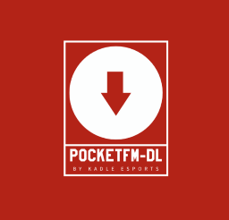
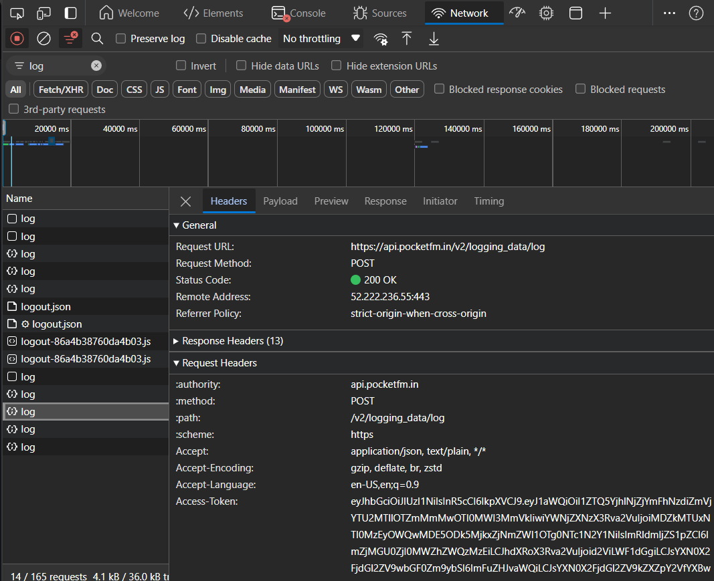

# PocketFM Downloader

<p align="center">
  
</p>

**PocketFM Downloader** is a command-line tool designed to download episodes from a PocketFM show based on a specific pattern. The tool allows you to easily select and download episodes, adding metadata such as album art to the downloaded files.

## Features

- **Download Episodes**: Download all or specific episodes from a PocketFM show.
- **Pattern Matching**: Specify a pattern to download specific episodes (e.g., all episodes, episodes before/after a certain number, etc.).
- **Metadata Management**: Automatically adds metadata, including album art, to the downloaded episodes.
- **Command-Line Interface**: Simple CLI with optional arguments for pattern and help.

## Folder Structure

Here is an overview of the project structure:

```
pocketfm_downloader/
│
├── bin/                            # Contains Windows Executable Files
│   ├── pocketfm-dl.exe             # Compiled executable
│   └── config.ini                  # Holds the access-token of PocketFM
│
├── images/                         # Contains images used in the README
│   ├── icon.png                    # Logo image for the README
│   └── access-token.png            # Image to show example location of access-token
│
├── src/                            # Source code for the PocketFM Downloader
│   ├── main.py                     # Main script to run the application
│   ├── download.py                 # Contains the function to download episodes
│   ├── pocketfm.py                 # Functions to interact with the PocketFM API
│   └── metadata_parser.py          # Function to add metadata
│
├── .gitignore                      # Specifies files and directories to be ignored by Git
├── LICENSE                         # License file for the project
├── README.md                       # Project README file
└── requirements.txt                # List of Python dependencies required for the project
```

If you plan on using the compiled application this is how your directory is supposed to look:

```
pocketfm_downloader/
│
├── pocketfm-dl.exe           # Compiled executable
└── config.ini                # Holds the access-token of PocketFM
```

## Installation

To use PocketFM Downloader, you can either clone the repository or use the precompiled executable available in the releases:

1. **Clone the Repository**:
    ```bash
    git clone https://github.com/advaithsshetty/pocketfm_downloader.git
    cd pocketfm_downloader
    ```

2. **Install Dependencies**:
    ```bash
    pip install -r requirements.txt
    ```

3. **(Optional)Add PocketFM Access Token to config.ini**
    Adding access token allows you to download all the stories that you have unlocked.
    Guests are capped with first few episodes.
    ```code
    [pocketfm]
    access_token = your_pocketfm_access_token
    ```

4. **Run the Script**:
    ```bash
    python main.py
    ```

Alternatively, download the precompiled executable from the [Releases](https://github.com/advaithsshetty/pocketfm_downloader/releases) page.

### How to get access token

1. Open <a href="https://pocketfm.com/">PocketFM web</a> and Login
2. Open developer tools and navigate to networks section
3. Filter out **log** and in the headers, you will find your access token.
<p align="center">
  
</p>

## Usage

### Basic Usage

```bash
pocketdm-dl "https://pocketfm.com/show_id"
```
Downloads episodes from the specified PocketFM show. You will be prompted to enter a pattern to specify which episodes to download.

### With Pattern

```bash
pocketfm-dl "https://pocketfm.com/show_id" -p "*"
```
Downloads all episodes from the specified show.

### Command-Line Options

- `URL`: The URL of the PocketFM show you want to download.
- `-p PATTERN, --pattern PATTERN`: The pattern to specify which episodes to download:
  - `*`: Download all episodes.
  - `*n`: Download episodes before `n`.
  - `n*`: Download episodes after `n`.
  - `n*m`: Download episodes between `n` and `m`.
  - `n`: Download a specific episode.
- `-h, --help`: Display the help message.

### Examples

1. **Download All Episodes**:
    ```bash
    pocketfm-dl "https://pocketfm.com/show_id" -p "*"
    ```

2. **Download Episodes Before Episode 10**:
    ```bash
    pocketfm-dl "https://pocketfm.com/show_id" -p "*10"
    ```

3. **Download Episodes After Episode 5**:
    ```bash
    pocketfm-dl "https://pocketfm.com/show_id" -p "5*"
    ```

4. **Download a Specific Episode (e.g., Episode 3)**:
    ```bash
    pocketfm-dl "https://pocketfm.com/show_id" -p "3"
    ```

## How It Works

1. **Fetching Data**: The tool fetches the show's data from PocketFM using the provided URL.
2. **Pattern Matching**: Based on the specified pattern, it identifies the episodes to download.
3. **Downloading Episodes**: The selected episodes are downloaded and saved in a folder named after the show.
4. **Adding Metadata**: Metadata, including album art, is added to the downloaded files for a better user experience. *Requires ffmpeg installed in system*.

## Warning

1. **Use Responsibly**: Please use this tool responsibly and respect the content creators' rights.
2. **Legal Disclaimer**: This tool is not affiliated with PocketFM. It is an unofficial tool created for educational purposes.
3. **Do not distribute the downloaded content**: The downloaded content is for personal use only. Do not distribute the downloaded content without the content creator's permission.
4. **Do not use this tool rapidly**: Using this tool rapidly can lead to a ban from PocketFM and I am not responsible for any bans.

## Audio Quality

Audios are directly downloaded from PocketFM, capped at **128kbps**. When higher quality audios (**256kbps**) are available, the tool will download the highest quality.

## Help

To view the help message, run:

```bash
pocketfm-dl -h
```

## Contributing

Contributions are welcome! Feel free to open issues or submit pull requests on GitHub.


## License

This project is licensed under the MIT License. See the `LICENSE` file for more details.

## Contributors
<p>
  <a href="https://github.com/advaithsshetty/pocketfm_downloader/graphs/contributors">
    
  </a>
</p>